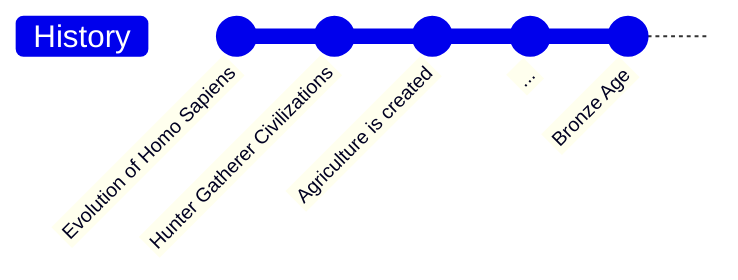
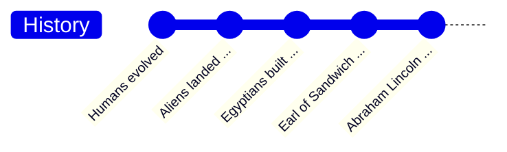
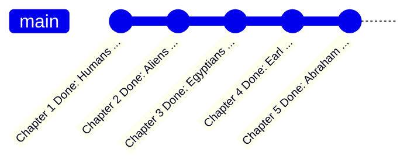
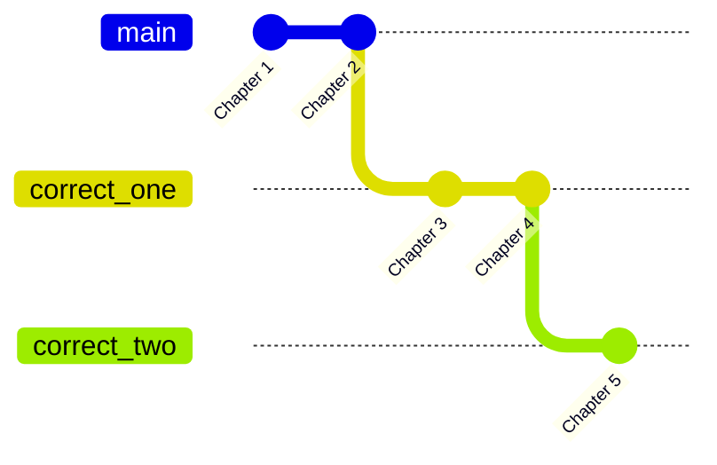
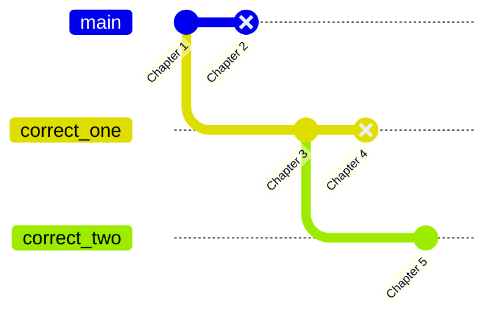
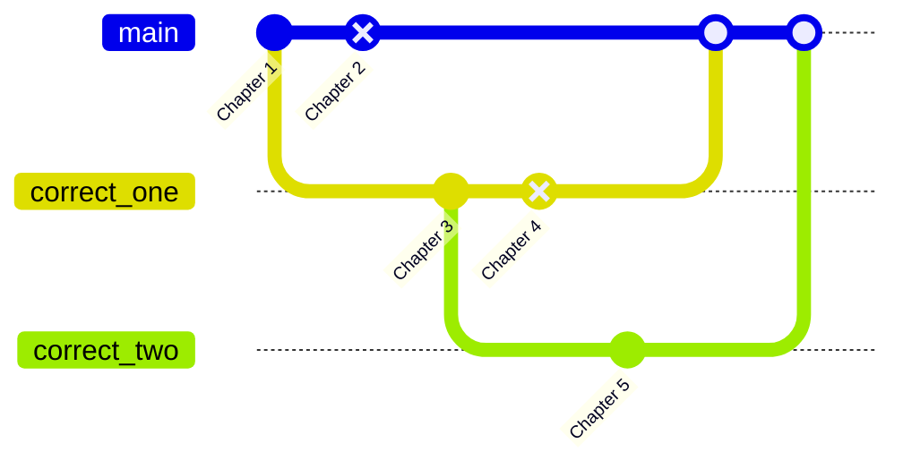
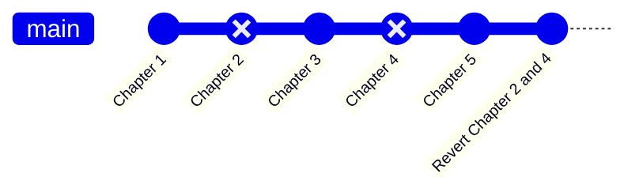

# Git Fundamentals

Welcome to the Git fundamentals branch! Here we are going to go over what git is,
some of its functionality, and do a small exercise.

## What is Git?

After all of those installations and commands, you
may be left wondering what it is all for.  Thankfully,
the software operates under a simple pretty premise.

### Writing History

Say we wanted to make a timeline of major events in human history.  Perhaps,
it would look something like the following.



As is time, the sequence of the events is linear in one line in perpetuity.
This is as simple as it gets.  

However, what if we imagine we were writing a book about history, 
and we had a list of events that we were pretty sure happened but not completely,
like so:

1. Humans evolved
2. Aliens landed on Earth
3. Egyptians built the pyramids
4. Earl of Sandwich invented inflatable shoes
5. Abraham Lincoln would become president of the USA

Similarly to before, we could just smack this all onto one timeline all at once:



Unfortunately, after writing all of this, you discover that chapter 2 and 4 are
not well corroborated by historical records and your friend Jaime says the 
first event is too vague to be interesting.  What are you to do?

Don't you worry!  Git is here to the rescue.

### Rewriting History

Through the power of Git, you can represent your book in the form of a 
repository.  A repository is a container, usually some directory, that Git 
documents every action and change that occurs within it (given it has been told
to do so by the user).  

Of course, tracking every change no matter how small can certainly seem excessive.
Why would I need to know that I rewrote this section 23 times and be able to revert
each and every space individually.  Well, you don't, because Git is much smarter
than that.

#### Snapshots

In order to make observing and manipulating changes easier, Git created something
called "commits", which act as snapshots of your repository at the time of its 
creation. Think of them as the dots on the line in the timelines, and the line
itself is the continuous stream of changes that happen between each dot.

With commits, you can probably see how we can begin to rectify our historical
kerfuffle.  Simply imagine our chapters as commits on a main branch of a
repository:



Now we have isolated each chapter into a snapshot of our timeline of continuous
changes, but how does that allow us to seamlessly fix our historical mishaps.

##### Slice and Dice 

Commits alone make it easier to visualize edits and changes to a project, but 
in order to actually fix mistakes, we're going to need some more tools.

Since this is merely an introduction into what Git is, we won't get into the
actual in-depth commands Git gives to perform git manipulations.  Instead,
simply imagine that you have a pair of digital scissors that can slice our
timeline into a bunch of pieces like so:



As you can see, we've split our book into 3 different lines of changes,
where each line starts with an event we have verified to be true.  From here
we can use our scissors again to further correct the timeline of our text:



Here we've taken our scissors and cut out the parts that were wrong and connected
all the chapters that were right.  We then stitched the changes between the 
4th snapshot and 5th snapshot onto the 3rd.  All that is left is to merge the 
snapshots back together onto one happy line:



With a little bit of cleaning up, it all looks fine and dandy again:



With that, the timeline is resolved and order is restored as now our book has 
only the mostly correct historical facts in it.  Although, it looks as though
you forgot to modify the chapter numbers.

### Preserving History

Along with our out-of-order numbering, the astute among you will notice we have 
a new snapshot at the end of our timeline indicating we reverted chapter 2 and 4.

While there are advanced techniques to physically rewrite history in git, 
the idea in this introduction is that manipulating history requires writing history.
Not all changes in a repository are going to be explicit code writing or new files.

This is a core ideal of Git.  Every change is preserved and accounted for as 
you write your project start to finish.  Learning to create efficient snapshots
of bite sized portions of your work can allow you to minimize these sorts of 
housekeeping commits, as well as, ensure that when you do have to do this, it is
not as hard.

**We use Git not because it is super easy or necessary for every project, but
rather that it allows us to check ourselves and have a safety net in the 
inevitable case of catastrophic failure or annoying bugs and typos.**


`sed -i 's/FISH ARE/GIT IS/g' | sed -i 's/FRIENDS/FRIEND/g'`

## Git Bootcamp

It is finally time to hit the ground running and finally use this infernal
application.  To begin all we need to do is create a simple repository.

#### Initialization

Create and enter a folder with the name `GOOSECORP` with the following 
command:

```bash
$ mkdir GOOSECORP && cd GOOSECORP
```

Once that is complete, all you need to do to create a repo is the following:

```bash
$ git init
```

or if you are on an old version of git and didn't set up your defaults:

```bash
$ git init -b main
```

TA-DA! That is all you need to do to create the repository.  If you open 
`GOOSECORP`, you will likely find that it is still "empty"; however, that
is because the repository folder that holds all of your changes uses a 
special naming convention that most OSes understand to mean that the folder 
shouldn't be visible by default.

If you go into the terminal and type `ls -a`, you should be able to see a folder
inside GOOSECORP called `.git`.  This hidden folder is your repository and,
if deleted, will wipe all of your change history.  Therefore, you shouldn't
do that if you would like to keep your stuff safe.

#### Commit and Yeet

As part of your work at GOOSECORP, you need to make a couple of files, such
as follows:

1. ACCOUNTING
2. HOMEWORK
3. REAL_BOOKS
4. HR

Now we are going to try and commit, since certainly a bunch of folders are 
changes right?  To commit these changes, you first have to "stage" them.

Essentially, Git is nice and only tracks what you tell it to, so you have to
use the `git add` command to add each file to the repository.  Since we 
have so many files, we can just do:

```bash
$ git add .
```

Now let's commit it with the following command:

```bash
git commit -m "Added all of our folders"
```

The commit command tells Git to take the snapshot, and the `-m` argument 
tells Git we would like to attach a message describing the commit.  

**NOTE:** Messages are expected by default, so it will open a text prompt asking you to enter a
message if you fail to add the message argument.

#### File Discrimination

As you probably found running that command, Git actually couldn't care less about
your silly little folders.  Only files get to be tracked by git, and folders
are not tracked until something within them are tracked.

Add a file in the `ACCOUNTING` folder with the following text:

```txt
$200 to not Big Joe
$100 to definitely not the Mafia
$040 to the president
```

Now run our `git add .` command again and construct a new commit (with a new 
message to match what changes we've made).

Should you have done everything right, the commit will have been made!  Now
it is time to figure out how to share this commit with all of your eager 
colleagues.

##### Commit Yeet

Go to your online repository service, whether it is GitHub or not, and create
a new repository.  If you have a good service, it will likely give you a list 
of commands to run in order to connect your remote repository.

For this project, I will be using GitHub with a repo named GOOSECORP, thus,
my remote is as follows:

```bash
$ git remote add origin git@github.com:KSBilodeau/GOOSECORP.git
```

Once you run your equivalent command, you are read to push your read commits 
to the remote repository:

```bash
$ git push
```

If for some reason, you do not have any changes staged and committed, you can
use this command instead, and it will establish the main branch on the remote
ahead of any changes and such.

```bash
$ git push -u origin main
```

Congratulations!  Should you reload your webpage, your repo will be successfully
located on the internet.

#### Branching

In our introduction, we split our history into a number of lines of changes.
Thankfully, that was not all just fiction and we can do it ourselves.

However, instead of doing complex history rearrangement like in the intro, we
are going to branch ahead of time and for the purposes of merely working outside
the main branch. As part of your work, you have been assigned the task of creating a "dev" branch
so that the developers can stop meddling where the accountants are working.

To do this task, go to your local GOOSECORP and do the following command:

```bash
$ git branch dev
```

This creates a branch called dev; however, if you make commits right now, you
will still be writing to the main branch.  In order to write to dev, you have 
to "check it out", using the aptly named `git checkout`:

```bash
$ git checkout dev
```

Now that you are in the dev branch, you might think it is time to push this 
branch to our remote.  Unfortunately, branches don't really exist until changes
are applied, thus, we must make a change, commit, and then push to create
our dev branch on our remote.

To do this, create a `dev` folder with a random file of your choosing.  Then
stage and commit the files as you did before.

Now having done that, you should be able to send your changes to the remote
with the following: 

```bash
$ git push
```

Since our branch is established now with a change, we don't need to do any
fancy shenanigans to tell the remote what to create with the `-u` argument.

#### Merging

You have learned a lot at this point.  This has convinced management that you
are ready for your biggest task yet, merging branches.

See, HR decided that a dev branch was actually unnecessary, and you could just
merge your changes back onto main.  Despite how complicated this sounds, it 
is actually rather simple.

Git works counter to what you might expect and requires you to be in the branch
you want to merge into.  Thus, we must first check out main before merging dev
into it.

To do so, run the following commands:

```bash
$ git checkout main && git merge dev
```

Voilà! The dev branch has merged into main and now the changes are lined up 
on one line of history rather than two.  Just like our history timeline in 
the introduction.

---

**CONGRATS!  HAVE FUN AND MESS AROUND. YOU HAVE SUCCESSFULLY COMPLETED A BASIC
CRASH COURSE IN GIT MANAGEMENT.**