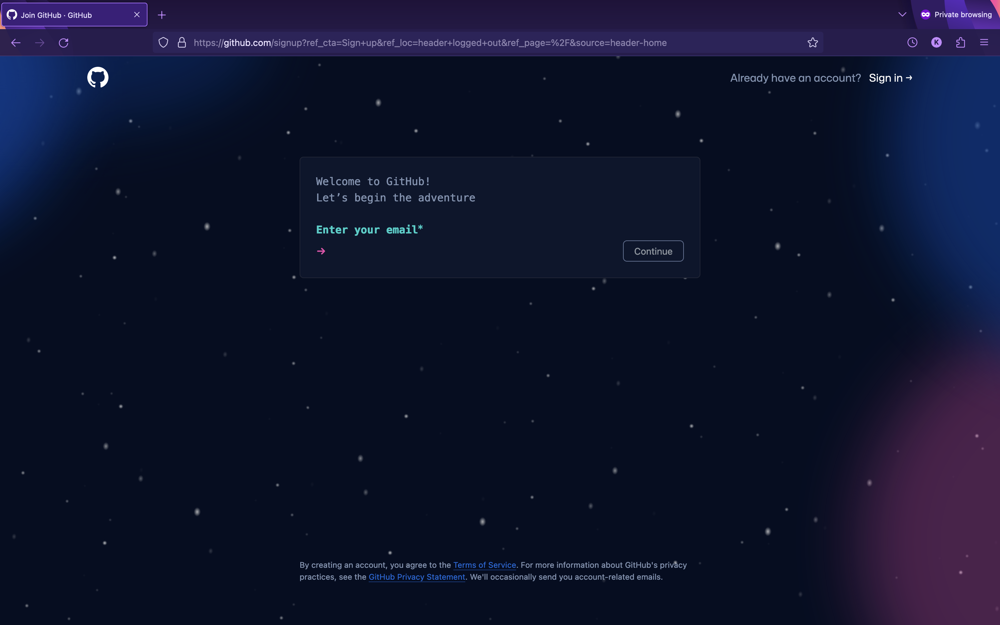

# The Unofficial Git Training Repo

This repo is a dedicated location for teachers and students to work
together through various simple git related tasks in order to learn the
importance of source version control software like Git.  Simply follow the
directions in order either as an individual or a group, and you should have
no trouble learning everything you need for using git in basic projects.

## Table of Contents:

1. [Installation](#step-1-git-installation-and-environment-prep)
2. [Set Up Online Repo Host](#step-2-create-an-online-repository-account)
3. [Set Up SSH Keys](#step-3-setup-ssh-keys)
4. [Set Up GPG Commit Signing](#step-4-setup-gpg-signing-keys)

---

## Step #1: Git Installation and Environment Prep

##### Windows:

Get the official binary from [here](https://git-for-windows.github.io/) and follow the installation instructions.

##### MacOS:

For macOS, there are currently three main options available in terms of installation options.  Choose whichever is most compatible with you and or your school's application installation policy:

1. Direct Binary Installation - get the DMG file from the same website as that you can find under the windows installation section aka [here](https://git-for-windows.github.io/).

2. Homebrew - for those who already have the Homebrew package manager installed already, then you can simply type the following into your terminal application:
```bash
brew install git
```
For those who wish to use the Homebrew package manager but do not have it already installed, simply run the following command and restart your terminal:
```bash
/bin/bash -c "$(curl -fsSL https://raw.githubusercontent.com/Homebrew/install/HEAD/install.sh)"
```
After that, you should be able to run the top command without any issue.
3. MacPorts - for those who already have the MacPorts package manager installed, you can simply type the following into your terminal (do note this will require inputting a root user password):
```bash
sudo port install git
```
For those who wish to use the MacPorts package manager but do not have it already installed, please consult the [MacPorts installation page](https://www.macports.org/install.php) for information regarding its installation.

##### Linux

There are several package managers available, so for the purposes of this tutorial, we shall provide the installation commands that are provided on the git main installation page; however, if you do not use either of these package managers, please consult your documentation:
1. DNF for Fedora and other RPM based Systems
```bash
sudo dnf install git-all
```
2. Apt-Get for Debian Based Systems such as Ubuntu
```bash
sudo apt install git-all
```
3. Pacman for Arch Linux
```bash
pacman -S git
```

##### ALL PLATFORMS

Finally, run the following commands to set your desired defaults
(opt to run whichever ones you feel are necessary):

```bash
git config --global user.name "REPLACE_WITH_USERNAME"
git config --global user.email "REPLACE_WITH_EMAIL"
git config --global init.defaultBranch "REPLACE_WITH_DEFAULT_BRANCH_NAME"
git config --global core.editor "REPLACE_WITH_TEXT_EDITOR_OF_YOUR_CHOICE"
```

You may also opt to edit the git configuration file all at once, in which case,
you can use the following command:

```bash 
git config --global --edit
```

To set the defaults seen above, you can follow this format:


```gitconfig
[user]
    email = YOUR_EMAIL
    name  = YOUR_NAME

[core]
    editor = YOUR_EDITOR

[init]
    defaultBranch = YOUR_DEFAULT_BRANCH
```


Excluding any of the sections will result in them defaulting to git's builtin
default settings.


**NOTE:** If you are planning on using an online repository service, you may
want to wait on doing this step as they may provide you with a private
email to use.

## Step #2: Create an Online Repository Account

The website you are most likely viewing this on, GitHub, is a source sharing
website that facilitates the distribution of code managed by git source control.
You, too, can utilize this service to host your programmatic content.

Of course, GitHub isn't the only repository service out there; however,
alternative services are beyond the scope of this instructional exercise.

##### Create a GitHub Account

You can find GitHub at [https://github.com/](https://github.com/), and it should look something
like this:


If you have an account, you can skip to the next section after logging in.
Otherwise, click `Sign Up`, and proceed with the instructions in this section.

##### Second Step: Register

Once you click `Sign Up`, you should be taken to an account registration page,
similar to what is shown below:



Simply follow the instructions, and you will have completed the steps necessary
to have your very own GitHub Account

##### Optional: Sign up for GitHub Student Developer Pack

As a GitHub account owner and student, you may be entitled to the benefits
of GitHub's Student Developer pack, which is an all around awesome selection
of tools and subscriptions.

All you need to do is navigate to the GitHub Student Developer pack page, as
seen here:


Click the large green button and navigate to the button labeled `Get student benefits`,
as seen here:


From there, simply follow the instructions provided, and it should not take more
than a day or two for your request to be approved.

## Step 3: Setup SSH Keys

If you decide to use an online repository service, SSH keys are a
fantastic method of pushing your code to your remotes in a safe and secure
fashion.

##### First Step: Generate the Key

Simply use the following command in your terminal:

```bash 
ssh-keygen -t ed25519 -C "your_email@example.com"
```

*For older systems, you may need to use the following command if the top one
does not work:*

```bash
ssh-keygen -t rsa -b 4096 -C "your_email@example.com"
```

This will then trigger the following prompts (follow the instructions in []
here, *do not type the [words]*):

```bash
Generating public/private algorithm key pair.
> Enter a file in which to save the key (/Users/you/.ssh/id_algorithm): [Press enter here]
> Enter passphrase (empty for no passphrase): [Type a passphrase here]
> Enter same passphrase again: [Type passphrase again here]
```

Congratulations, you have successfully created an SSH key!

###### Adding to your SSH agent

On most platforms, simply use the following command to add your key to
your SSH agent:

```bash
ssh-add ~/.ssh/id_ed25519
# or for legacy systems
ssh-add ~/.ssh/id_rsa
```

On macOS, it is recommended to add the SSH passphrase to your keychain,
so you will want to use this command instead:

```bash
ssh-add -K ~/.ssh/id_ed25519
# or for legacy systems
ssh-add -K ~/.ssh/id_rsa
```

**However**, on macOS Monterey, `-K` and `-A` were deprecated, so use the following
command instead:

```bash
ssh-add --apple-use-keychain ~/.ssh/id_ed25519
# or for legacy systems
ssh-add --apple-use-keychain ~/.ssh/id_rsa
```

##### Optional Step: Adding your key to your repo provider

For the purposes of this tutorial, we will only be covering adding
to GitHub.

###### GitHub

You are going to want to first log in and navigate to the settings page, like so:


Then you are going to go to the `SSH and GPG keys` pane and click the `New SSH Key` button:


Finally, you are going to fill in your key information and then click `Add SSH key`:


To test your connection run the following command and follow its instructions:

```bash
ssh -T git@github.com
```

Should your connection be successful, the final prompt should read as follows:

```
Hi YOUR_USERNAME! You've successfully authenticated, but GitHub does not
provide shell access.
```

## Step 4: Setup GPG Signing Keys

Now you have set up git, it is important to ensure that your commits can
be confirmed to be yours.  To do this, we can use a thing known as a GPG key
to sign your commits with your name.

**NOTE:** Just as with setting up an online repository provider, this step
is also optional.

To complete this section, consult the GPG signing docs
from GitHub starting [here](https://docs.github.com/en/authentication/managing-commit-signature-verification/generating-a-new-gpg-key).
From here on out, we will be working strictly in the realm of Git.

---

<p align="center">
<b>SWITCH TO THE GIT FUNDAMENTALS BRANCH</b>
</p>